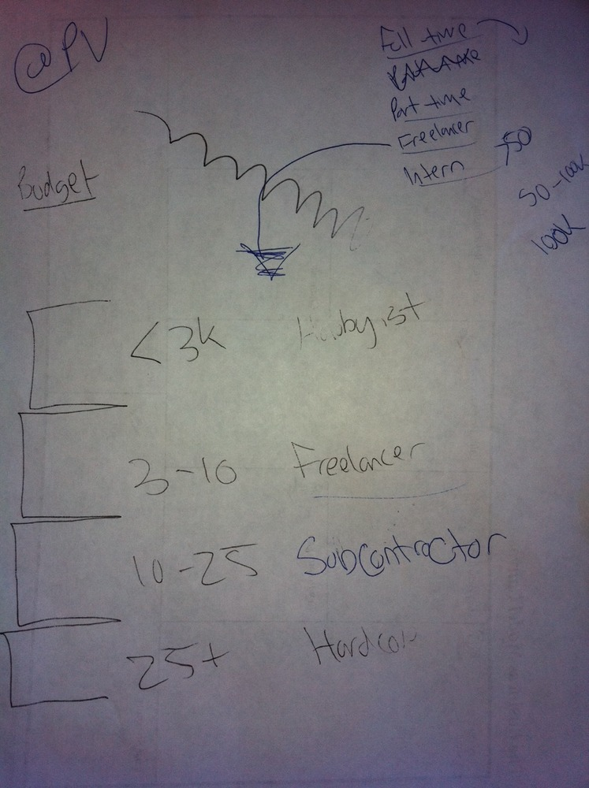

*This post is from the Hello World Posterous Archive*

It's been a crazy last week quitting our jobs, packing our lives into a duffle bag, and moving from San Antonio to Mountain View. We never thought that after 3 Day Startup this is where we would end up so quickly. Special thanks to Pat Condon for sponsoring us at 3DS and pushing us to build something of lasting value. Hello World is joining the 500 Startups accelerator program and will be mentored by the best in the business. Already in just two days we've refined our pitch, coded some new features, and started talking to key people who want to use our product. At this rate Hello World will be Incredible Hulk unstoppable by demo day.

As of right now our concept is "Sortfolio for developers" and our pitch is "Hello World creates profiles that get developers hired", especially after today we expect and hope to iterate on this rapidly. Startup Lessons Learned was yesterday and despite all the new methods we learned for thinking about our customers, it wasn't hard to notice that every speaker, even Brad Smith (CEO of Intuit), had the "we're hiring" pitch. We ran into tons of other startups that were having similar problems;

* Where do we find developers?
* How do we pitch them?
* After we find someone, how do we know they are good?

In this environment it's crazy that every developer doesn't have two jobs, yet we know so many that are funemployed. The disconnect in the market is very apparent. We know the problem affects almost every company hard right now, and are thinking about the solution every day.

Patrick Vlaskovits came to give Batch #001 a chat about customer development hacks. This is what came out of it for us:

We're thinking that you can ask developers their typical project price range and ellicit how serious they are / their own perceived value of their work. This might work well for freelancers, but we also want to target full-time and part-time employees. Hopefully this would lead to a better matching.
