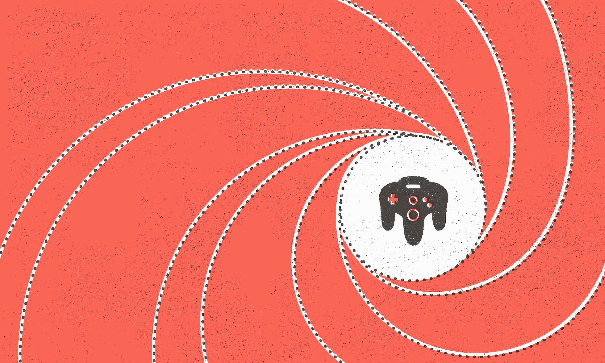

GoldenEye 64 had a special place in my heart when I was growing up. It was the first game my parents wouldn't let me buy due to violent content. I saved up allowances and dug up couch treasures for months to taste the forbidden fruit. The effort turned into one of the pillars of my childhood experiences. I still vividly remember where to place the proximity mines on Temple to get crazy spawn point kill streaks against my little brother. Fifteen years later, it still inspires me, but not for the proximity mines.

<figure>

<figcaption>Illustration by Alexandra Bond</figcaption>
</figure>

  It's hard to imagine that this game almost didn't exist. The makers of GoldenEye, Rare, faced a lot of challenges. Rare's studio head said,

  > “When Nintendo asked if we wanted to do it, we said, ‘well not really.’ We were trying to build our own IP, and film tie-ins meant a lot of ownership by the film company.”

  The team faced insane amounts of adversity and uncertainty. Starting out, they didn't even know what the specs were for the new platform.  [Wikipedia on the game's development](https://en.wikipedia.org/wiki/GoldenEye_007_%281997_video_game%29#Development).

  > Final N64 specifications and development workstations were not initially available to Rare: a modified Sega Saturn controller was used for some early play testing, and the developers had to estimate what the finalized console's capabilities would be.

  Getting closer to the release date, the final platform specs were released and they had to make significant graphic cuts to make it work.

  > The final Nintendo 64 hardware could render polygons faster than the SGI Onyx workstations they had been using, but the game's textures had to be cut down by half. Karl Hilton explained one method of improving the game's performance: "A lot of GoldenEye is in black and white. RGB color textures cost a lot more in terms of processing power. You could do double the resolution if you used greyscale, so a lot was done like that. If I needed a bit of color, I'd add it in the vertex." [^1]

  While doing all this, their team had almost no idea what they were doing when they started out. Sound familiar?

  GoldenEye 007 was developed by an inexperienced team, eight of whom had never previously worked on video games. David Doak commented in 2004;

  > "Looking back, there are things I'd be wary of attempting now, but as none of the people working on the code, graphics, and game design had worked on a game before, there was this joyful naïveté."

  Scope was so slim, they didn't even originally plan out the legendary multiplayer mode that arguably made the game so successful. It was done almost exclusively by one guy as an afterthought.

  > The game's multiplayer mode was added late in the development process; Martin Hollis described it as "a complete afterthought." According to David Doak, the majority of the work on the multiplayer mode was done by Steve Ellis, who "sat in a room with all the code written for a single-player game and turned GoldenEye into a multiplayer game."

  Despite everything, the game went on to become the third highest selling N64 game, inspire console shooting games, and win a crazy amount of awards. Next time you're heading down the wrong way of the [entrepreneurial rollercoaster](http://www.fourhourworkweek.com/blog/2008/10/03/harnessing-entrepreneurial-manic-depression-making-the-rollercoaster-work-for-you/), take a deep breath, make a cup of tea, and remember that you can make it happen. Persevere and dominate.

  Thanks to [Andy Parker](https://about.me/andylynnparker) for editing. Illustration by [Alexandra Bond](https://alexandra-bond.com/).

[^1]: [Source: Wikipedia](https://en.wikipedia.org/wiki/GoldenEye_007_(1997_video_game))
